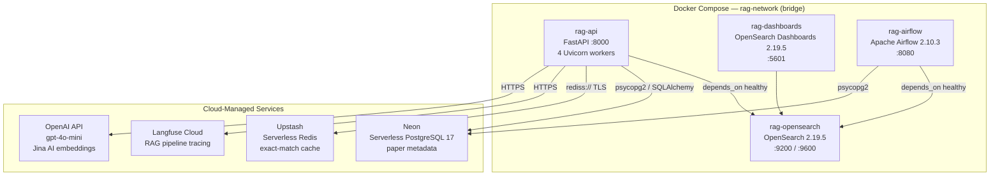
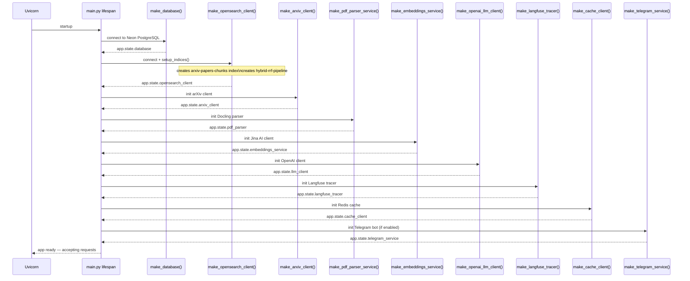
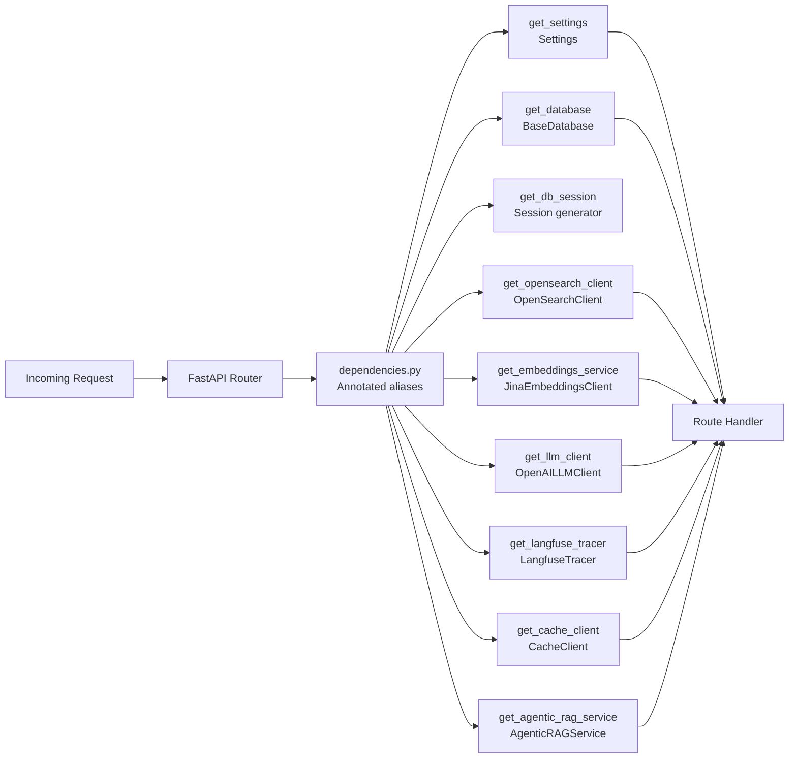
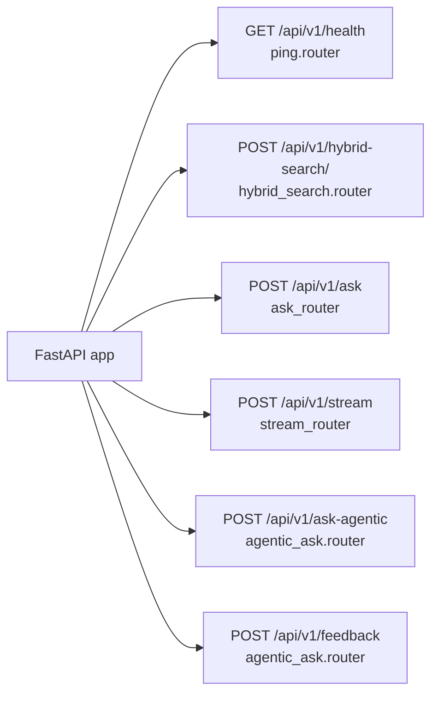

# Phase 1: Infrastructure Foundation

Phase 1 establishes the full local + cloud infrastructure that every later phase builds on. Four Docker containers run locally; four managed cloud services are accessed over the network.

---

## 1. Container & Cloud Topology

---

## 2. FastAPI Application Startup Sequence

The `lifespan` context manager in `src/main.py` initialises every service in this exact order before the app begins accepting requests.

---

## 3. Dependency Injection Flow

FastAPI injects services per-request through `src/dependencies.py`. Every handler receives typed clients without touching `app.state` directly.

---

## 4. Registered API Routes

