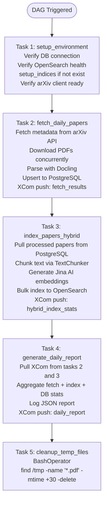
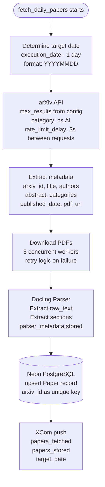
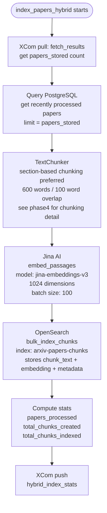
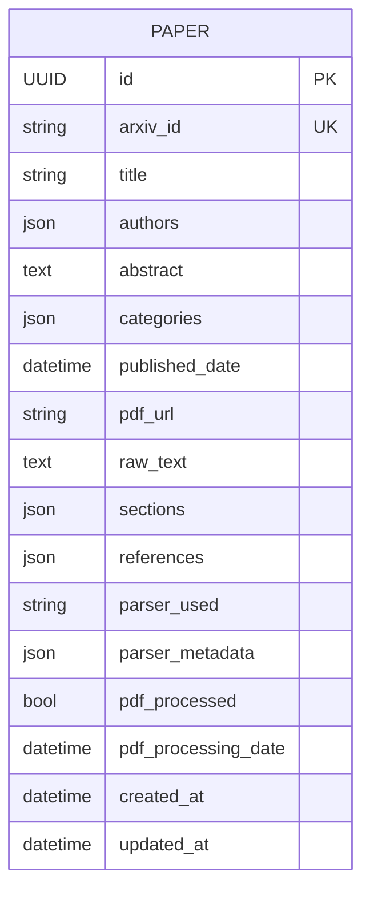
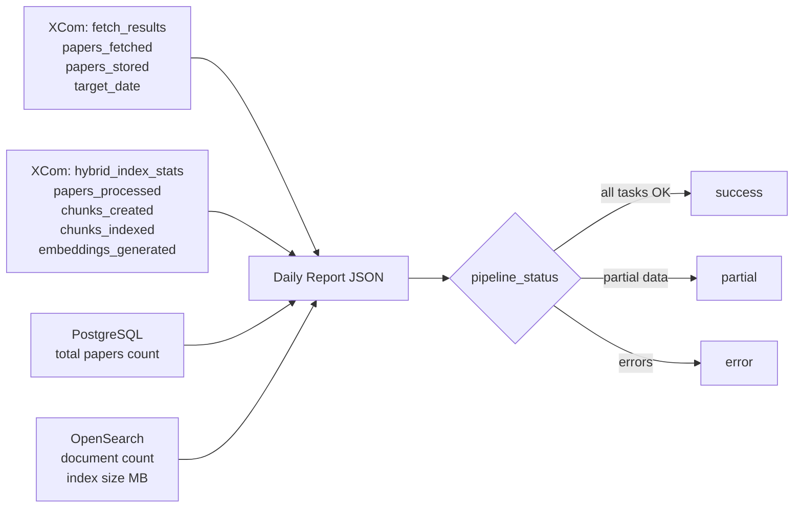

# Phase 2: Data Ingestion Pipeline

Phase 2 adds the automated data pipeline that fetches arXiv papers daily, parses their PDFs, and stores structured content in PostgreSQL. All orchestration is handled by Apache Airflow.

---

## 1. Airflow DAG — Task Dependency Chain

**Schedule:** `0 6 * * 1-5` (Monday–Friday, 6 AM UTC)  
**DAG ID:** `arxiv_paper_ingestion`  
**Max active runs:** 1 (no parallel runs)

---

## 2. Task 2 Detail — Paper Fetching & Processing

---

## 3. Task 3 Detail — Hybrid Indexing

---

## 4. PostgreSQL Paper Schema

---

## 5. Daily Report Structure

Task 4 assembles a JSON report from XCom data of previous tasks:

