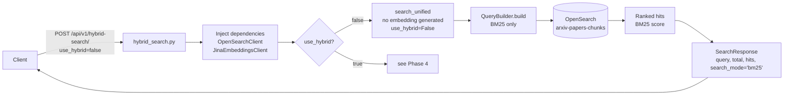
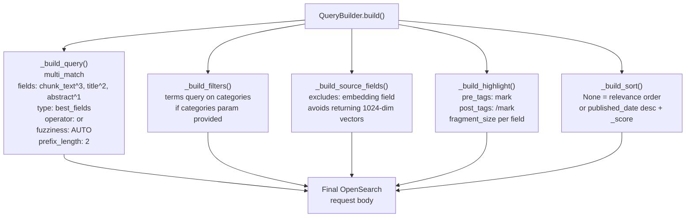
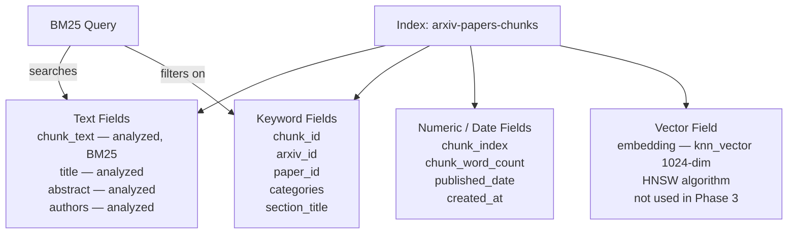
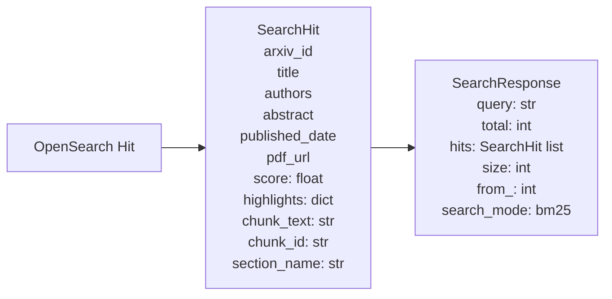
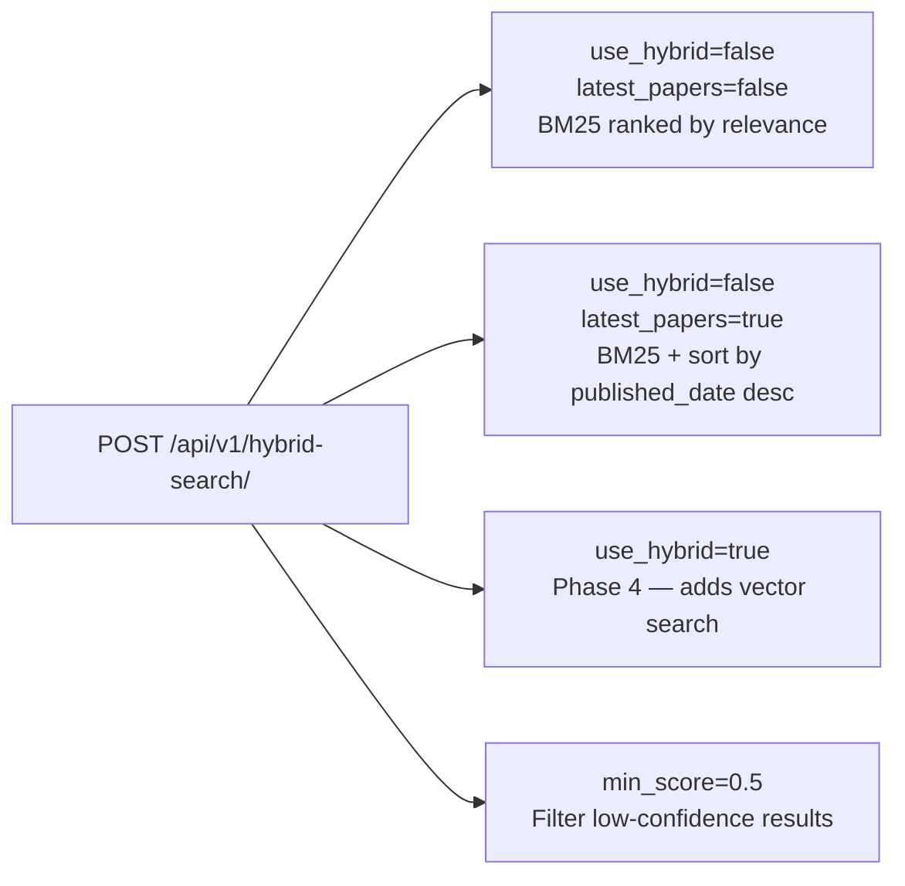

# Phase 3: Keyword Search — BM25

Phase 3 introduces the first search endpoint using BM25 — the classic probabilistic ranking algorithm. This is the search foundation that every production RAG system needs before adding semantic layers.

---

## 1. BM25 Request Flow

---

## 2. QueryBuilder Internals

The `QueryBuilder` (`src/services/opensearch/query_builder.py`) assembles the full OpenSearch request body.

---

## 3. OpenSearch Index Structure (Phase 3 view)

At Phase 3, only the text fields are used. The `embedding` field exists in the mapping (added in Phase 4) but is not yet populated.

---

## 4. SearchHit Response Shape

---

## 5. Search Modes Supported at This Endpoint

