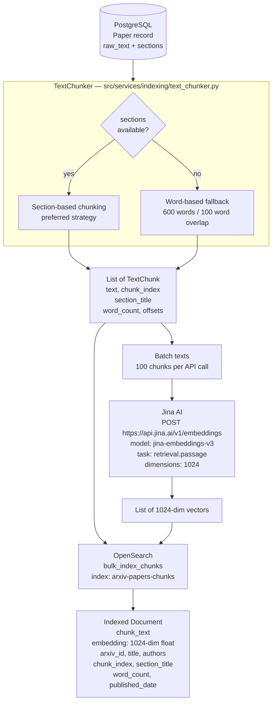
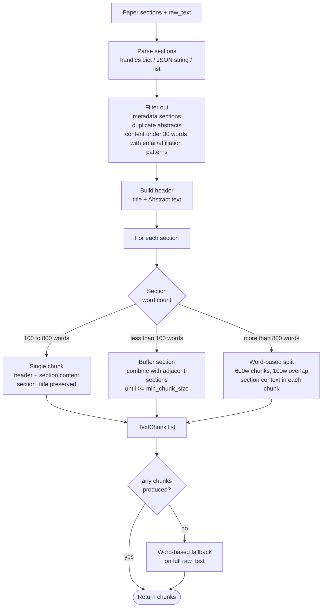
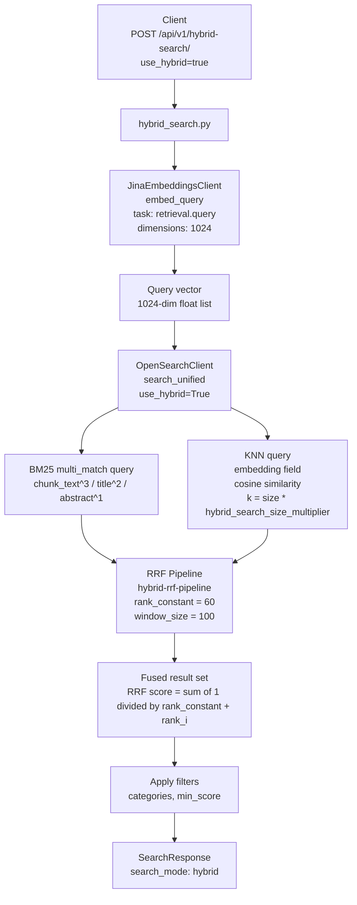
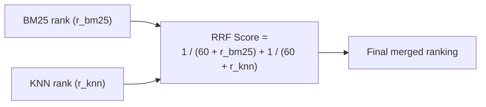
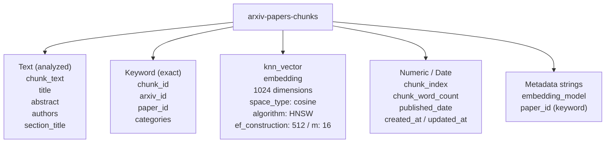

# Phase 4: Chunking & Hybrid Search

Phase 4 adds two major capabilities: intelligent text chunking of papers into retrievable segments, and semantic vector search fused with BM25 via Reciprocal Rank Fusion (RRF).

---

## 1. Document Indexing Pipeline

This pipeline runs inside Airflow Task 3 (`index_papers_hybrid`) for every paper stored in PostgreSQL.

---

## 2. TextChunker — Chunking Strategy Decision Tree

---

## 3. Hybrid Query Flow (BM25 + Vector + RRF)

When `use_hybrid=true`, the search endpoint generates an embedding for the query and executes a hybrid search.

---

## 4. RRF Score Formula

Both sub-queries contribute equally. A document ranked 1st in BM25 but not found by KNN still scores `1/(60+1) ≈ 0.016`. Appearing in both lists compounds the score.

---

## 5. OpenSearch Index — Full Mapping

