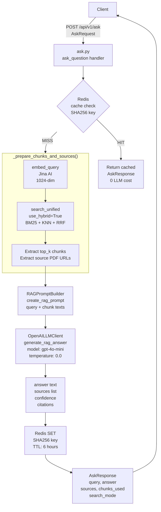
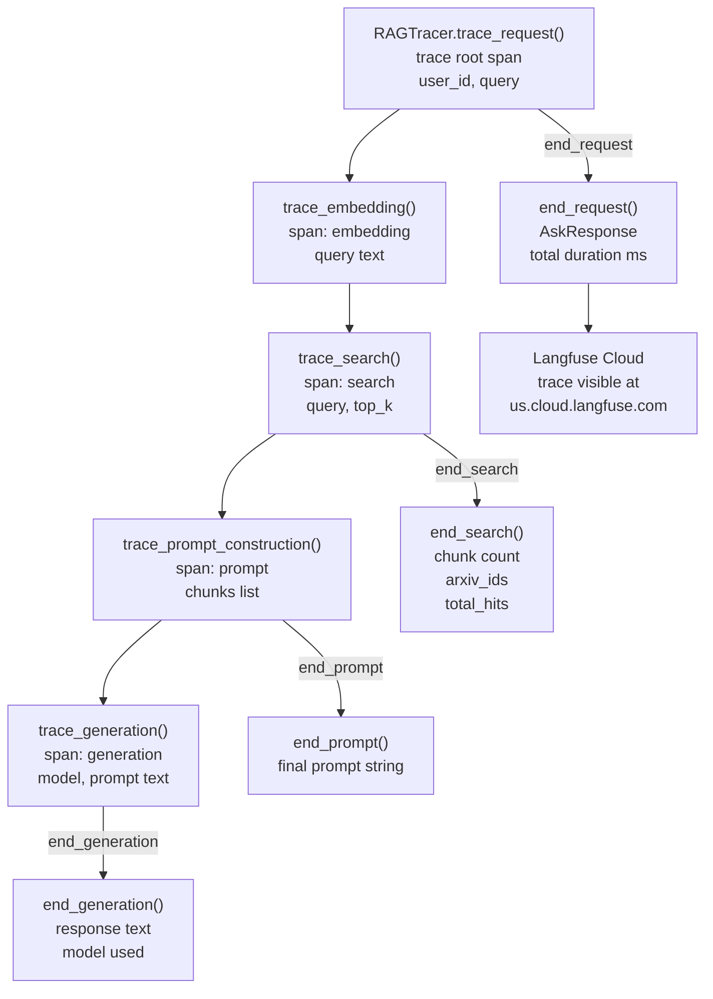
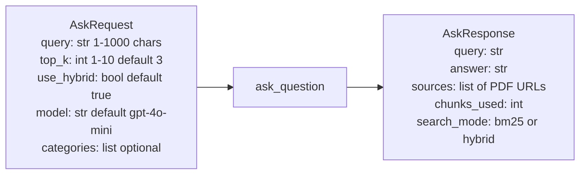
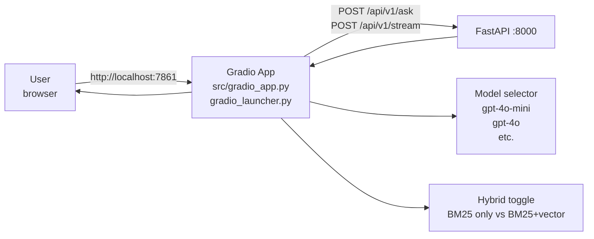

# Phase 5: Complete RAG Pipeline

Phase 5 connects the hybrid search layer to an LLM (OpenAI `gpt-4o-mini`) to produce grounded answers. Two endpoints are added: standard (full response) and streaming (Server-Sent Events).

---

## 1. Standard RAG Flow — POST /api/v1/ask



---

## 2. Streaming RAG Flow — POST /api/v1/stream

```mermaid
flowchart TD
    CLIENT2[Client] -->|POST /api/v1/stream\nAskRequest| STREAM_R[ask.py\nstream_question handler]
    STREAM_R --> SAME_PREP[Same preparation\nembed + hybrid search\nRAGPromptBuilder]
    SAME_PREP --> STREAM_LLM[OpenAILLMClient\ngenerate_rag_answer_stream\nasync generator]
    STREAM_LLM --> SSE[StreamingResponse\ntext/event-stream]
    SSE -->|yield chunk| CLIENT2
    SSE -->|yield done=true| CLIENT2
    note right of SSE: Each chunk:\n{response: str, done: bool}
```

---

## 3. Langfuse Tracing — Span Hierarchy

Every call to `/api/v1/ask` is wrapped in nested RAGTracer context managers that send telemetry to Langfuse Cloud.



---

## 4. AskRequest / AskResponse Schema



---

## 5. Gradio Interface

Phase 5 also adds a browser-based chat UI launched separately from the API.


