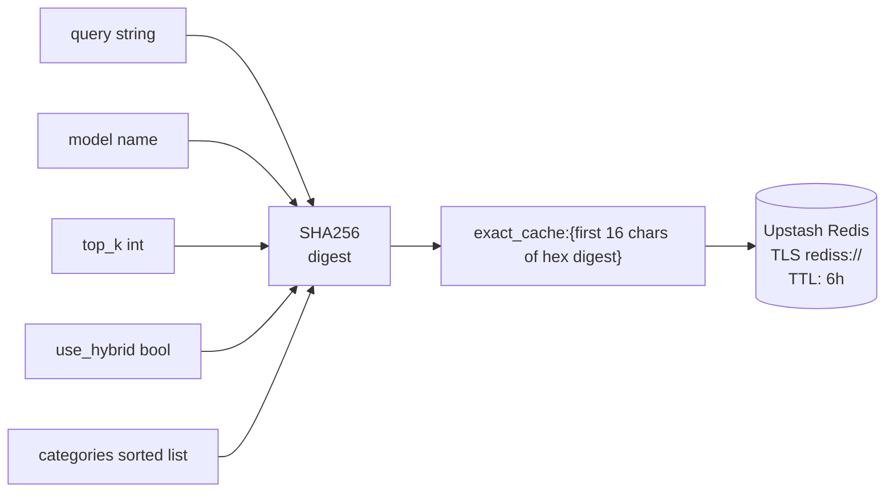
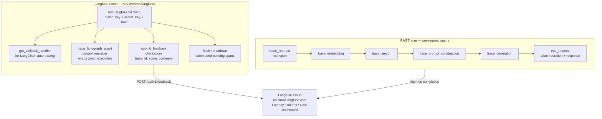
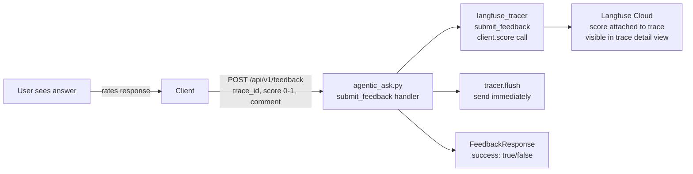
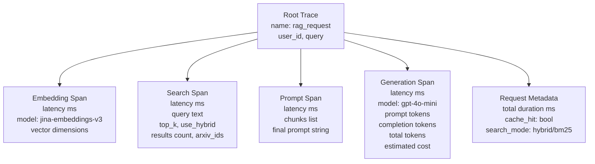
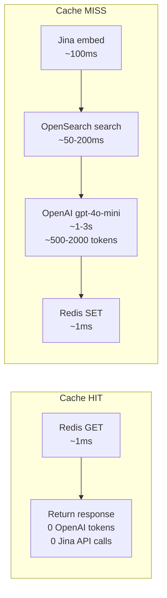

# Phase 6: Production Monitoring & Caching

Phase 6 makes the RAG pipeline production-ready by adding two layers: exact-match response caching via Upstash Redis (100x+ speedup on repeated queries) and end-to-end pipeline tracing via Langfuse Cloud.

---

## 1. Cache-First Request Pattern

```mermaid
flowchart TD
    REQ[POST /api/v1/ask\nAskRequest] --> KEY[_generate_cache_key\nSHA256 hash of:\nquery + model + top_k\n+ use_hybrid + sorted categories\ntruncated to first 16 chars]
    KEY --> RGET[Redis GET\nexact_cache:{key}]

    RGET --> HIT{cache\nhit?}
    HIT -->|YES\nO1 Redis read| CACHED_RESP[Return cached AskResponse\n0 embedding cost\n0 search cost\n0 LLM cost]
    HIT -->|NO| PIPELINE[Full RAG pipeline\nembed + search + LLM]

    PIPELINE --> RSET[Redis SET\nexact_cache:{key}\nvalue: serialized AskResponse\nEX: 21600 seconds = 6 hours]
    RSET --> FRESH_RESP[Return fresh AskResponse]

    CACHED_RESP --> CLIENT[Client]
    FRESH_RESP --> CLIENT
```

---

## 2. Cache Key Generation Detail



---

## 3. Langfuse Trace Lifecycle



---

## 4. Feedback Loop



---

## 5. Observability Data Captured Per Request



---

## 6. Cost Comparison: Cache Hit vs Miss


