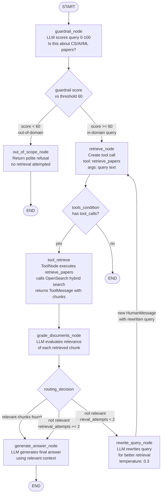
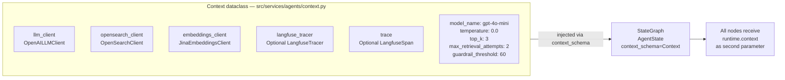
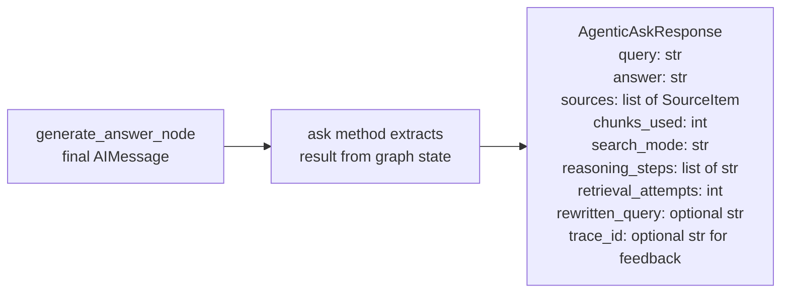
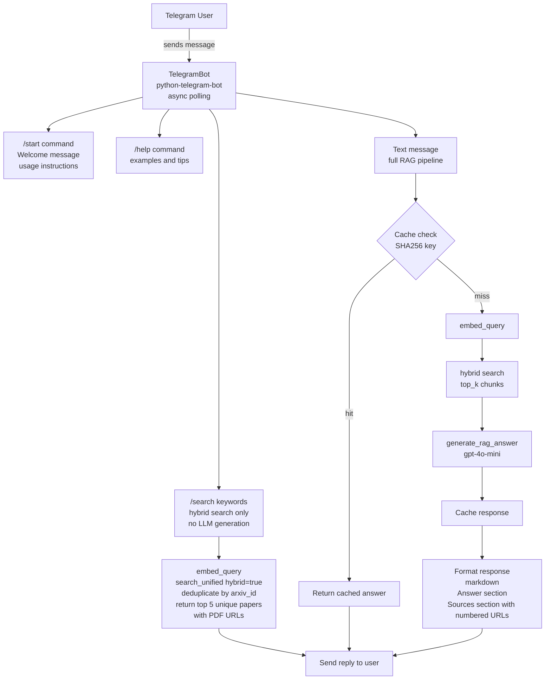
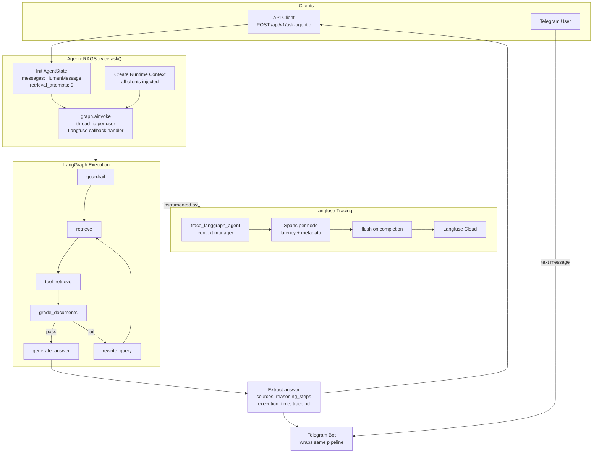

# Phase 7: Agentic RAG with LangGraph & Telegram Bot

Phase 7 replaces the single-shot RAG call with an intelligent multi-step agent. A LangGraph state machine decides whether to retrieve, grade retrieved docs, rewrite the query, or reject the question — before generating an answer. A Telegram bot also wraps the full pipeline for mobile access.

---

## 1. LangGraph State Machine — Full Node Graph

---

## 2. AgentState — Data Flowing Through the Graph

```mermaid
flowchart TD
    subgraph STATE["AgentState (TypedDict) — src/services/agents/state.py"]
        MSG["messages\nAnnotated list with add_messages reducer\nHumanMessage / AIMessage / ToolMessage"]
        OQ["original_query\nset by retrieve_node on first attempt"]
        RQ["rewritten_query\nset by rewrite_query_node"]
        RA["retrieval_attempts\nincremented by retrieve_node\nmax: 2 from Context"]
        GR_RES["guardrail_result\nGuardrailScoring\nscore: int, reason: str"]
        RD2["routing_decision\nRoutingDecision\nroute: generate_answer or rewrite_query"]
        SRC["sources\nDict tool_call_id to ToolMessage output"]
        REL_SRC["relevant_sources\nList of SourceItem\narxiv_id, title, authors, url, score"]
        GD["grading_results\nList of GradingResult\ndocument_id, is_relevant, score, reasoning"]
        META["metadata\nruntime analytics / tracing info"]
    end

    GUARD2[guardrail_node] -->|writes| GR_RES
    RETRIEVE2[retrieve_node] -->|writes| OQ & RA & MSG
    TOOL2[tool_retrieve] -->|writes| SRC & MSG
    GRADE2[grade_documents_node] -->|writes| RD2 & REL_SRC & GD
    REWRITE2[rewrite_query_node] -->|writes| RQ & MSG
    GEN2[generate_answer_node] -->|writes| MSG
```

---

## 3. Runtime Context — Dependency Injection into Nodes

Nodes do not use global state. All clients are injected via `Runtime[Context]`.

---

## 4. Node-by-Node Logic Summary

```mermaid
flowchart TD
    subgraph N1["guardrail_node"]
        G_IN[Latest HumanMessage] --> G_LLM[LLM with GUARDRAIL_PROMPT\nreturns GuardrailScoring\nfail-open: default score=100 on LLM error]
        G_LLM --> G_OUT[guardrail_result written to state]
    end

    subgraph N2["retrieve_node"]
        R_IN[Latest query from messages] --> R_CHK{attempts >= max?}
        R_CHK -->|yes| R_FALL[Return fallback AIMessage\nno tool call]
        R_CHK -->|no| R_TOOL[AIMessage with tool_calls\nname: retrieve_papers\nargs: query string]
    end

    subgraph N3["tool_retrieve / ToolNode"]
        T_IN[Tool call from retrieve_node] --> T_EXEC[Execute retrieve_papers tool\nOpenSearch hybrid search\nBM25 + KNN + RRF]
        T_EXEC --> T_OUT[ToolMessage\nformatted paper chunks + metadata]
    end

    subgraph N4["grade_documents_node"]
        GD_IN[Latest query + ToolMessage context] --> GD_LLM[LLM with GRADE_DOCUMENTS_PROMPT\nlooks for binary_score: no in response]
        GD_LLM --> GD_ROUTE[routing_decision: generate_answer or rewrite_query]
    end

    subgraph N5["rewrite_query_node"]
        RW_IN[original_query from state] --> RW_LLM[Structured LLM output\nQueryRewriteOutput Pydantic model\ntemperature: 0.3\nfail-open: keyword expansion]
        RW_LLM --> RW_OUT[New HumanMessage\nwith rewritten_query]
    end

    subgraph N6["generate_answer_node"]
        GA_IN[Latest query + context from ToolMessage] --> GA_LLM[LLM with GENERATE_ANSWER_PROMPT\ntemperature: 0.0\nfail-open: error message]
        GA_LLM --> GA_OUT[AIMessage with final answer]
    end
```

---

## 5. AgenticAskResponse Schema

---

## 6. Telegram Bot — Handler Flow

---

## 7. Full Phase 7 End-to-End Flow

